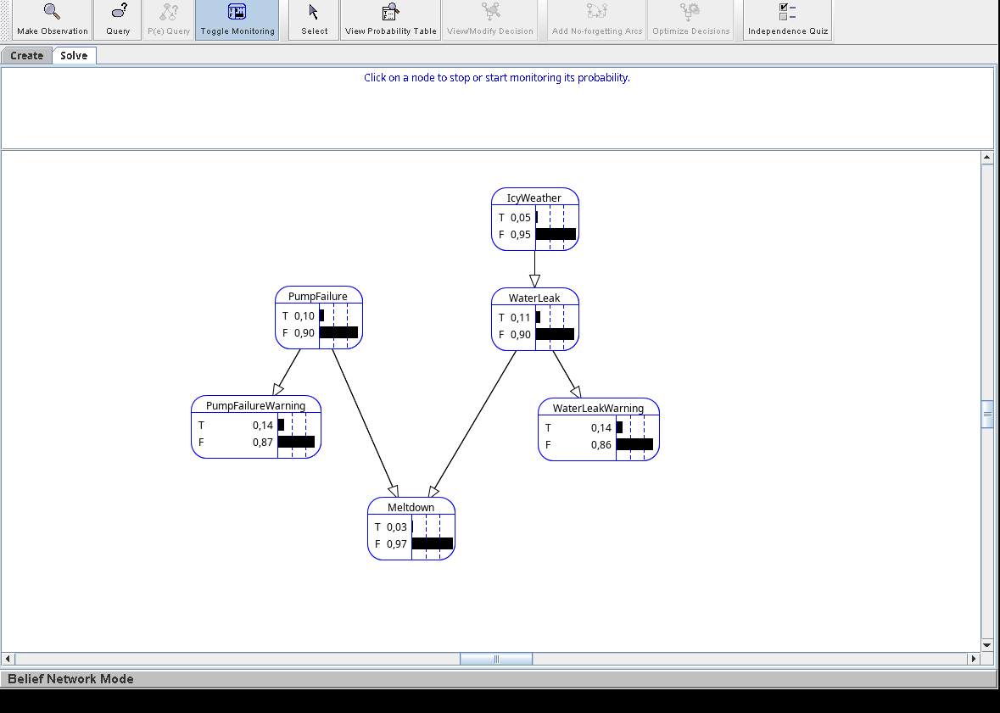
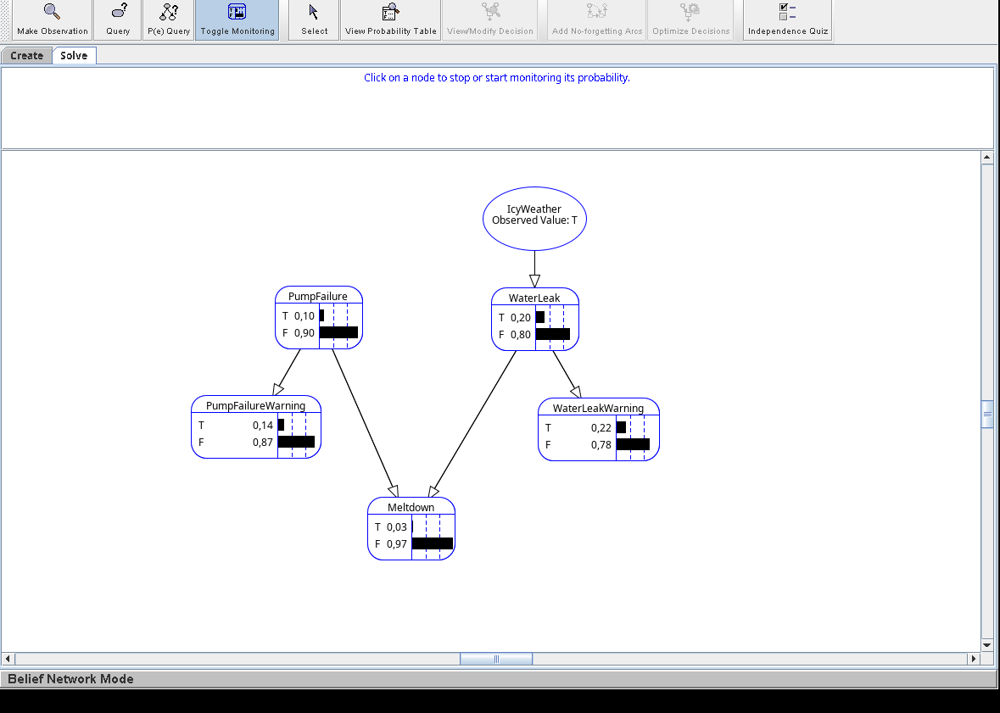
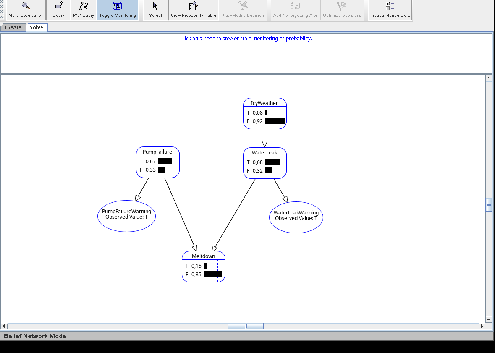
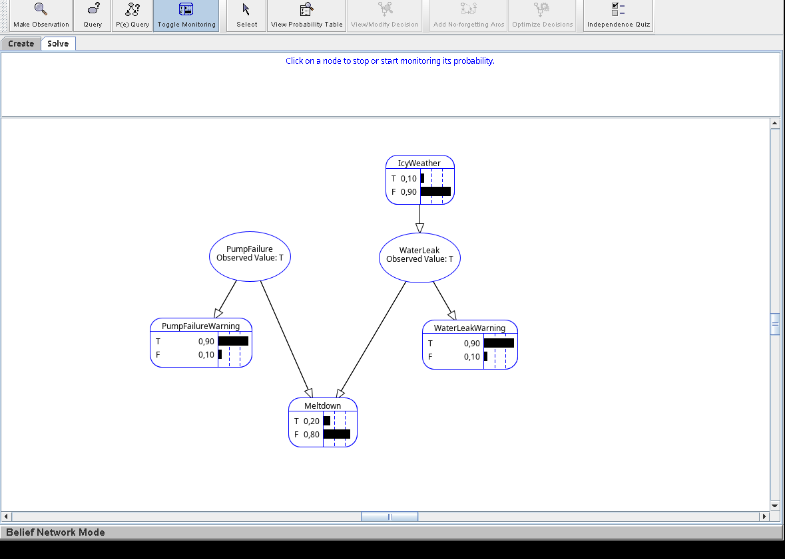
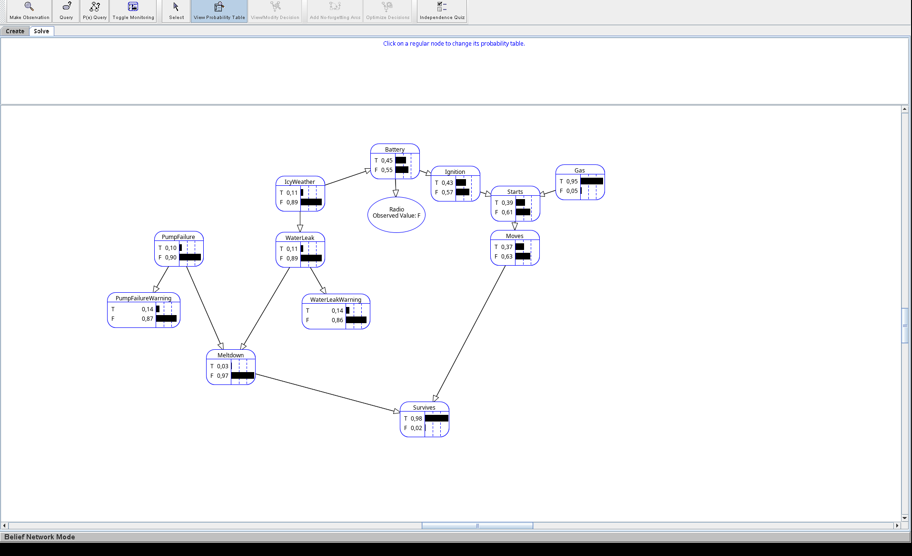
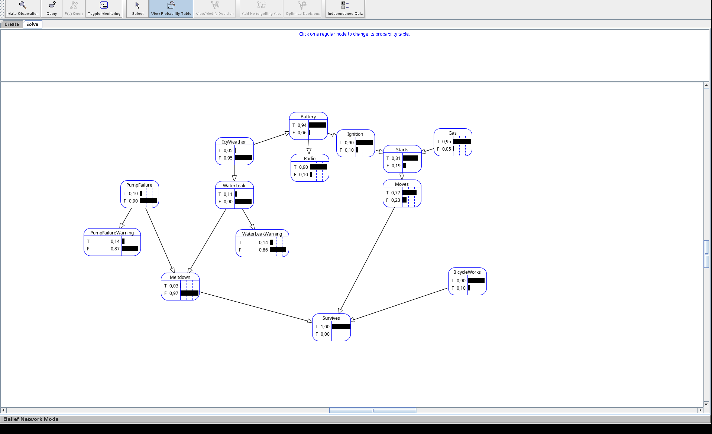

# LAB4 THEORY QUESTIONS

## Part 2:

### a) What is the risk of melt-down in the power plant during a day if no observations have been made? What if there is icy weather?

3% change of melt-down if no observation has been made. It's still 3% change if icy weather has been observed.

### b) Suppose that both warning sensors indicate failure. What is the risk of a meltdown in that case? Compare this result with the risk of a melt-down when there is an actual pump failure and water leak. What is the difference? The answers must be expressed as conditional probabilities of the observed variables, P(Meltdown|...).

P(Meltdown | PumpFailureWarning=T, WaterLeakWarning=T) = 15%

P(Meltdown | PumpFailure=T, WaterLeak=T) = 20%

### c) The conditional probabilities for the stochastic variables are often estimated by repeated experiments or observations. Why is it sometimes very difficult to get accurate numbers for these? What conditional probabilites in the model of the plant do you think are difficult or impossible to estimate?

Things like pump failures or water leaks are difficult to make observations for since we don't intentionally want to experiment with these dangerous actions. In our model it would likely be difficult/inaccurate to estimate for example P(Meltdown | PumpFailure, WaterLeak) as this is a very specific scenario is probably very unlikely in the real world.

### d) Assume that the "IcyWeather" variable is changed to a more accurate "Temperature" variable instead (don't change your model). What are the different alternatives for the domain of this variable? What will happen with the probability distribution of P(WaterLeak | Temperature) in each alternative? 

We could have something similar to the existing model with a boolean domain (e.g. cold/not cold) which simple and easy to model, but unrealistic since we don't know *how* cold. We could also model it as discrete bins (e.g. very cold/cold/warm/very warm) which is probably still pretty easy to model and more realistic. Or we could go for a continous domain with real degrees instead which would be much more difficult to model but probably the most realistic.

## Part 3

###  During the lunch break, the owner tries to show off for his employees by demonstrating the many features of his car stereo. To everyone's disappointment, it doesn't work. How did the owner's chances of surviving the day change after this observation?

The chances of surviving without any observations for the radio is 99%, which is decreased to 98% when the radio isn't working.

### The owner buys a new bicycle that he brings to work every day. The bicycle has the following properties:
* P(bicycle_works) = 0.9
* P(survives | ¬moves ∧ melt-down ∧ bicycle_works) = 0.6
* P(survives | moves ∧ melt-down ∧ bicycle_works) = 0.9 
* How does the bicycle change the owner's chances of survival?

The bicycle increases the owner's chance of survival from 99% to approximately 100%. We calculated this by adding a BicycleWorks node to the graph which is a parent to Survives, and updating the probability table for Survives.

### It is possible to model any function in propositional logic with Bayesian Networks. What does this fact say about the complexity of exact inference in Bayesian Networks? What alternatives are there to exact inference?

If the network can represent any propsitional function, then any SAT instance can be encoded as a Bayesian network. Example:

Take a fromula over vars: A,B,C create one root node per variable  with prior 0.5, and one node per connective whose CPT contains only 0s and 1s. This kind of CPT is a truth table wirtten in probability notation, so those nodes are deterministic functions of their parent with the final node representing the complete formula which is going to be satisfied. 

The roots are coin flips, every assignment has a prob. of 2^n and P(formula=T) equals the number of satisfying assignments divided by 2^n. If this is greater than 0, we can satisfy the formula. 

#### Complexity:

A polynominal inference algortihm would therefore guve a poly-time-SAT solver, which means it is NP-hard. 

It sums over every combination of unobserved variables and the number of combinations doubles with each extra variable. Small networks go fast, larger grows with complexity. 

#### Alternatives
One alternative is rejection sampling where we try random samples and throw away the ones that don't match our logic formula. This wastes a lot of examples when there is few solutions to the problem though.

Instead we could also use likelihood weighting which assigns each sample a weight instead of discarding them. There seems to be different methods for this (e.g. Gibbs sampling) but the general idea is that this should work better, especially when solutions satisfying the problem are rare.